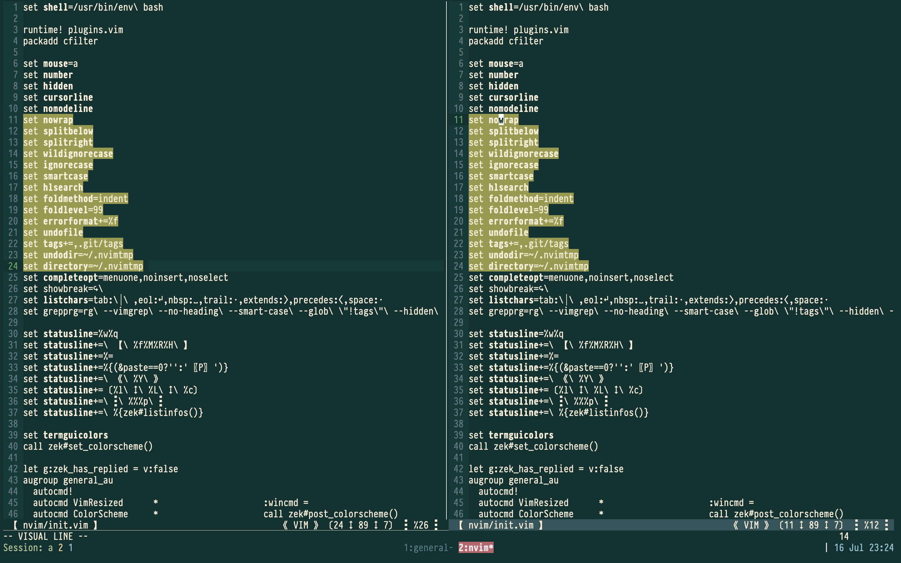
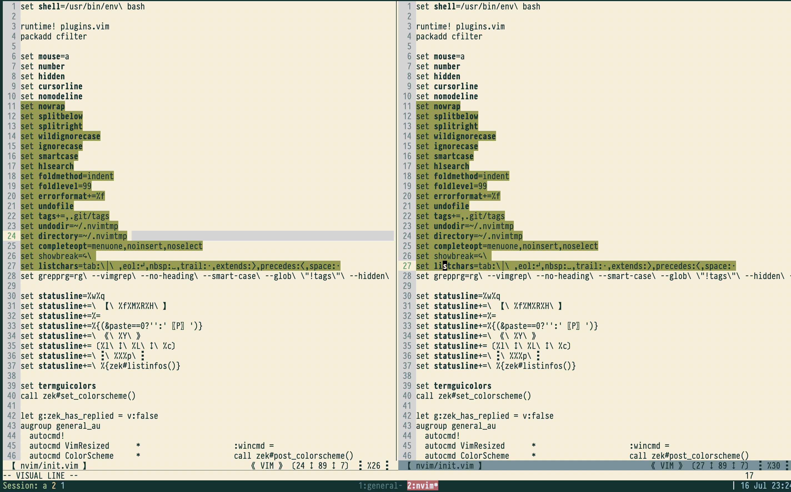

# Menguless: Yet another colorless color scheme

## First things first, how does it look?

- Dark version

- Light version

## Inspiration

There are a lot of coincidences that happened through the road leading to this color scheme.

A summary, chronological order;

- My dear friend [mengu](https://twitter.com/mengu) sent a [tweet](https://twitter.com/mengukagan/status/1269001361821241345) and mentioned if someone makes a color theme with those colors he would happily use it.
- I was trying Emacs those times (everybody has bad days ha? Do not judge me) and with the help of a [generic macro](https://git.sr.ht/~lthms/colorless-themes.el) which powers a couple of colorless emacs color themes, I quickly create a basic color theme with colors borrowed from the design.
- So, my friend mengu and the color`less` come together and built the name: menguless.
- Then I got back to my beloved Vim and realized that I liked those colors. I was already sold on the idea of using as few colors as possible. My eyes can not accept the schemes with full of different colors.
- So I created the Vim version of the theme. And here is the result.

## Credits

I used [Patient Vimmer](https://github.com/romainl)'s [vim-rnb](https://github.com/romainl/vim-rnb) to generate the color scheme files. menguless is the default, dark background boy. menguless_light is the light background option. Still uses the same color palette from the original design.

## Contribute

I did set some basic colors at the beginning and incrementally improved the colors as I stumbled upon on a necessity. So if you have any feedback please do not hesitate to create an issue and/or a pull request.
